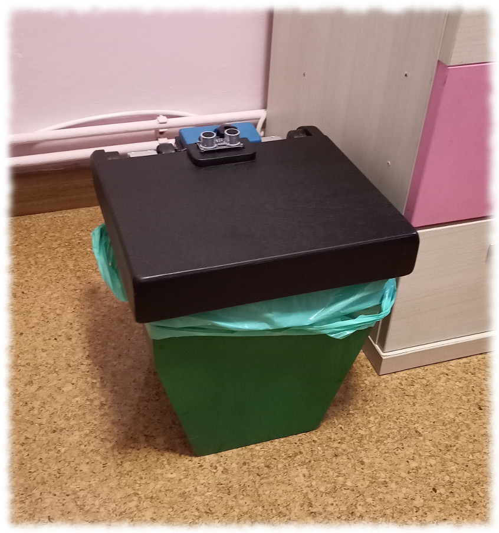
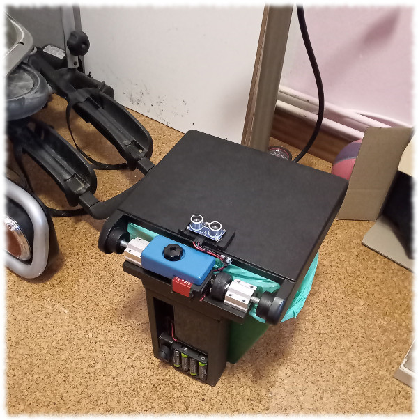
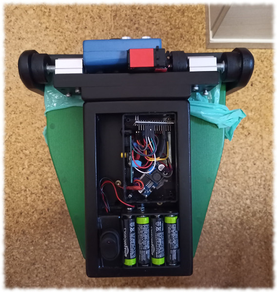

# Self-opening trash can

Started as a woodworking project, a trash can and a lid made from two pine boards and a sheet of plywood. Made almost entirely using a jigsaw and then painted with acrylic spray... then ...to make it less boring, I've soldered some electronic circuits and wrote an Arduino sketch to control the automation :robot:

## Video demo?
https://www.dropbox.com/s/rejr2ne6q7ah067/basurito.mp4?dl=0

## Features

* Opens when detects any presense above the lid;
* Closes automatically in a few seconds if open automatically;
* Can be open and closed manually with a button (to change bags or keep open for a longer time);
* Has a led signaling opening/closing/booting states;

## Components

* Arduino Nano (not genuine, some inexpensive clone, I'm a bum);
* Ultrasonic proximity sensor;
* 25kg-cm servo (some noname from AliExpress, works awesome);
* 12V battery power + DC/DC step down adaptor (12V=>5V);

